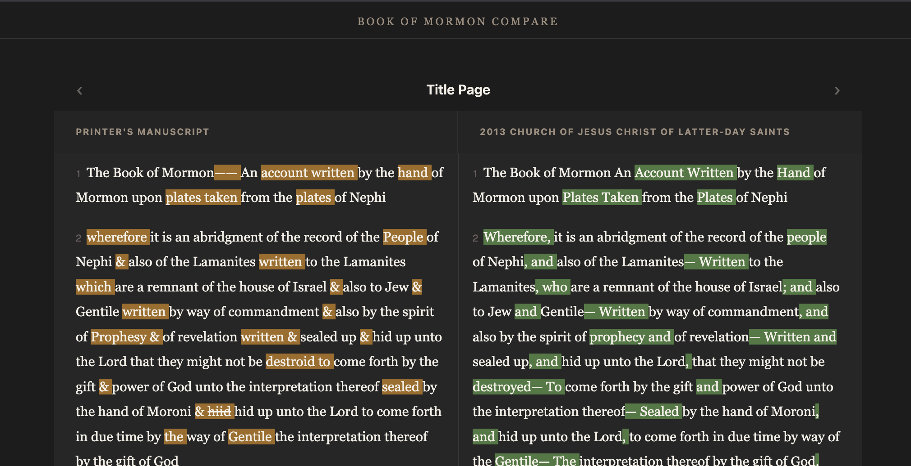

**NOT READY FOR RELEASE — STILL CLEANING UP DATA**

# Book of Mormon Compare



A side-by-side diff viewer for comparing different versions of the Book of
Mormon, built with [Fresh 2](https://fresh.deno.dev/) and Deno.

Live (beta): https://bofm.scripturecompare.org?tutorial

## Features

- Side-by-side verse comparison across multiple text versions
- Word-level diff highlighting (additions and removals)
- Click a word to highlight all matching words across both columns
- Per-column version selector via URL query params (`?v1=2013&v2=om`)
- Jump-to-chapter dialog and swipe navigation between chapters
- Selection menu for sharing or copying verse ranges
- First-visit tutorial
- Dynamic OG images for social previews
- Per-book overview pages listing every chapter with its textual-variant count
- Non-extant chapters (present in one version, missing in another) are clearly
  marked

## Text Versions

| Key    | Description                                              |
| ------ | -------------------------------------------------------- |
| `om`   | Original Manuscript                                      |
| `pm`   | Printer's Manuscript                                     |
| `1830` | 1830 First Edition                                       |
| `1837` | 1837 Second Edition                                      |
| `1840` | 1840 Nauvoo Edition                                      |
| `1841` | 1841 Liverpool Edition                                   |
| `2013` | 2013 Church of Jesus Christ of Latter-day Saints edition |

Each version has its own page at `/versions/<key>`.

## Setup

Install Deno: https://docs.deno.com/runtime/getting_started/installation

Clone the repo and run the dev server:

```bash
git clone https://github.com/JakeAve/book-of-mormon-compare.git
cd book-of-mormon-compare
deno task dev
```

Then open http://localhost:5173.

### Git hooks

The repo ships pre-commit and pre-push hooks in `.githooks/` that run
`deno task check` and the test suite. Git doesn't pick these up automatically —
after cloning, run once:

```bash
deno task setup
```

This points git at `.githooks/` and marks the hooks executable. The setting is
local to your clone (not checked in), so each contributor runs it once.

## Tasks

```bash
deno task setup        # One-time: configure git hooks after cloning
deno task dev          # Vite dev server
deno task build        # Production build → _fresh/
deno task start        # Serve the production build
deno task check        # fmt check + lint + type check
deno task test         # Run all unit tests
deno task pre-commit   # check + test (run by .githooks/pre-commit)
deno task pre-push     # check + test (run by .githooks/pre-push)
deno task align:*      # Aligns verses and chapters to 2013 Church of Jesus Christ edition
deno task build:stats  # Recompute data/stats/variants.json (run after align:pm)
```

## Adding a new text version

1. Drop chapter JSON files at `data/bom/<key>/<book>/<chapter>.json`.
2. Add the display name to `VERSION_DISPLAY_NAMES` in `lib/data.ts`.

Versions are auto-discovered from subdirectories of `data/bom/` at runtime. See
[CLAUDE.md](./CLAUDE.md) for the verse JSON format and the manuscript alignment
pipeline.

## Environment

- `SITE_URL` — canonical site URL used for OG images and absolute links.
  Defaults to `https://bofm.scripturecompare.org`.
- `GITHUB_TOKEN` — fine-grained PAT (repo-scoped, Issues read/write) used to
  file correction reports as GitHub issues. Without it the report form returns
  503.

`deno task dev` and `deno task start` load variables from a local `.env` file
(gitignored) if one exists — put `GITHUB_TOKEN=...` there for local dev.

## Disclaimer

This project is an independent study and research tool. It is not affiliated
with, endorsed by, or sponsored by The Church of Jesus Christ of Latter-day
Saints, the Community of Christ, or any other church or organization. All
scriptural text belongs to its respective publishers; this site presents it for
comparative study.
